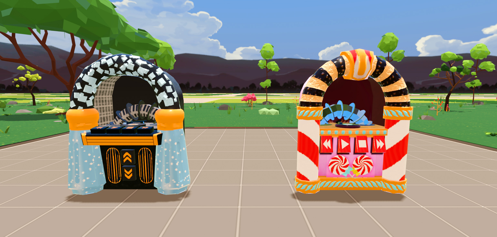

# Decentraland Jukebox Salt & Sugar

This is a multiplayer jukebox you can integrate into your Decentraland scene.
The audio files are uploaded with the scene, so there is no need for setting up a streaming server.
Just add the mp3 into the audio folder and update the playlist.ts file.

# Updates

The most up to date version you can find here
https://github.com/CansyLand/dcl-jukebox

# Sandstorm

Created Within the scope of the Sandstorm creativity & Growth grant:
https://app.sandstorm.co/build/99/view/decentraland-dao-c-g-grant-5-salt-sugar

|  |  |
| :--------------------------------------------------------------: | :----------------------------------------------------------------: |
|                       Julebox Salt Dancing                       |                       Julebox Sugar Dancing                        |

# License 3D Files

"Jukebox Salt & Sugar" by CansyLand is licensed under CC BY-SA 4.0.
To view a copy of this license, visit https://creativecommons.org/licenses/by-sa/4.0/.

The 3D files are licensed under the Creative Commons Attribution-ShareAlike 4.0 International License.
To view a copy of this license, visit https://creativecommons.org/licenses/by-sa/4.0/
or send a letter to Creative Commons, PO Box 1866, Mountain View, CA 94042, USA.

# License Code

Copyright 2024 CansyLand
http://www.apache.org/licenses/LICENSE-2.0
Licensed under the Apache License, Version 2.0 (the "License");
you may not use this file except in compliance with the License.
You may obtain a copy of the License at
Unless required by applicable law or agreed to in writing, software
distributed under the License is distributed on an "AS IS" BASIS,
WITHOUT WARRANTIES OR CONDITIONS OF ANY KIND, either express or implied.
See the License for the specific language governing permissions and
limitations under the License.
